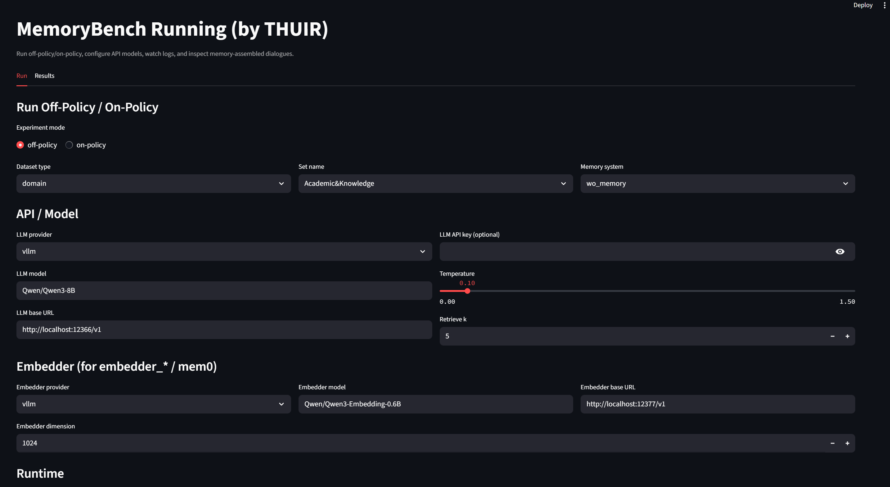

# MemoryBench Frontend (Streamlit)



This frontend supports:

- Running `off-policy` and `on-policy` experiments.
- Configuring API-based model access (OpenAI or OpenAI-compatible endpoint).
- Choosing memory systems from the existing benchmark methods.
- Monitoring live experiment logs.
- Browsing results and every dialogue item, including the assembled memory context prompt.

## 0. Install project dependencies

```bash
pip install -r requirements.txt
cd baselines/mem0
pip install -e .
```

Then install nltk data in python:

```python
import nltk
nltk.download('punkt')
nltk.download('wordnet')
nltk.download('stopwords')
```

Download Huggingface Dataset to local directory (optional, but can speed up the first run):

```bash
huggingface-cli download --repo-type dataset --resume-download THUIR/MemoryBench --local-dir /path/to/MemoryBench
```


## 1. Install frontend dependency

```bash
pip install -r frontend/requirements.txt
```

## 2. Launch frontend

```bash
streamlit run frontend/streamlit_app.py
```

## 3. Key notes

- The app only writes new runtime artifacts:
  - `frontend/runtime_configs/` for temporary configs.
  - Your chosen output directory for experiment results.
